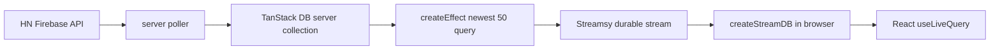

# Hacker News newest stream demo

This example demonstrates TanStack DB running on the server as a reactive source for a Durable State stream.



## Run

From the repository root:

```bash
bun install
bun --cwd examples/hackernews-newest-stream run dev:api
bun --cwd examples/hackernews-newest-stream run dev:web
```

Open the Vite URL (default `http://localhost:5175`). The API server defaults to port `1339`.

## What to look for

- `src/server/hnews.ts` polls Hacker News `newstories` and fetches item details.
- `src/server/server-collection.ts` creates a server-owned TanStack DB collection and writes source data through the sync writer (`begin`, `write`, `commit`).
- `src/server/stream-projection.ts` uses `createEffect` over the server collection. `enter` and `update` deltas become Durable State upserts; `exit` deltas become deletes.
- `src/client/main.tsx` consumes `/streams/session/main` with `createStreamDB` and renders stories from the client-side TanStack DB collection.

Useful environment variables:

- `PORT` (default `1339`)
- `HN_POLL_INTERVAL_MS` (default `60000`)
- `HN_NEWEST_LIMIT` (default `50`)
