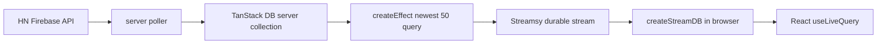

# Hacker News newest stream demo

This example demonstrates **TanStack DB running on the server as a reactive materializer** that
projects a query result onto a **Streamsy Durable State stream**. A single Bun process polls
Hacker News, maintains a server-side collection, materializes the "newest 50" view with a
`createEffect` live query, and appends each change to a durable stream that the browser mirrors
with `createStreamDB`.



## The materializer / projection pattern

The heart of the demo is a server-side **materializer**: a reactive query whose output is appended
to a durable stream as change events, so any number of clients can replay it without re-running the
query.

1. **Source collection** (`server-db.ts`, `server-collection.ts`) — a server-owned TanStack DB
   collection of raw HN stories. The poller writes rows through a sync writer (`begin`, `write`,
   `commit`); an index on `[time, id]` keeps the ordered query efficient.
2. **Materializer** (`stream-projection.ts`) — `createEffect` runs a live query over the source
   collection (`where type = story`, `orderBy [time, id] desc`, `limit 50`, `select` the view
   columns). TanStack DB re-runs it incrementally and hands `onBatch` the _delta_ for each change.
3. **Projection to durable state** — each delta becomes a Durable State change event appended to
   the Streamsy stream: `enter`/`update` deltas become `upsert` events, `exit` deltas become
   `delete` events. The query result — not the raw poll — is what lands on the stream.
4. **Client mirror** (`client/main.tsx`) — the browser opens the same stream with `createStreamDB`
   and renders it via `useLiveQuery`. It never talks to HN directly; it only replays the projected
   view.

The durable stream is the seam: the server decides _what the view is_, the stream makes it
_durable and resumable_, and every client is a thin replay of the same change log.

### Package layout note (`@durable-streams/state` 0.3.x)

`@durable-streams/state` 0.3 splits its entry points: the framework-agnostic state core
(`createStateSchema`, `ChangeEvent`) stays at the root and is used by `state-schema.ts`, while the
TanStack-DB-coupled StreamDB client (`createStreamDB`, `StreamDB`) lives at
`@durable-streams/state/db` and is used by `client/main.tsx`. `@tanstack/db` is a peer dependency
and is declared directly here.

## Run

From the repository root:

```bash
bun install
bun --cwd examples/hackernews-newest-stream run dev
```

Open the Bun server URL (default `http://localhost:1339`). The same Bun process serves the API,
Streamsy stream, and built React client; no separate Vite dev server or proxy is needed.

To run on a different port:

```bash
PORT=1349 bun --cwd examples/hackernews-newest-stream run dev
```

For API-only work, you can skip the client build:

```bash
bun --cwd examples/hackernews-newest-stream run dev:api
```

## Smoke test

The smoke test runs **offline**: it stands up a tiny local fixture that mimics the HN Firebase API,
points the poller at it via `HN_API_BASE`, and then asserts that the server collection →
`createEffect` projection emits client-readable Durable State events onto the Streamsy stream
(one `hn-story` upsert per fixture story, each a well-formed change event).

From the repository root:

```bash
bun run smoke:hackernews
```

or from this package:

```bash
bun run --cwd examples/hackernews-newest-stream smoke:http
```

## What to look for

- `src/server/hnews.ts` polls Hacker News `newstories` and fetches item details. The API base URL
  is overridable with `HN_API_BASE` (used by the smoke test).
- `src/server/server-collection.ts` creates a server-owned TanStack DB collection and writes source
  data through the sync writer (`begin`, `write`, `commit`).
- `src/server/stream-projection.ts` uses `createEffect` over the server collection. `enter` and
  `update` deltas become Durable State upserts; `exit` deltas become deletes.
- `src/client/main.tsx` consumes `/streams/session/main` with `createStreamDB` and renders stories
  from the client-side TanStack DB collection.

Useful environment variables:

- `PORT` (default `1339`)
- `HN_POLL_INTERVAL_MS` (default `60000`)
- `HN_NEWEST_LIMIT` (default `50`)
- `HN_API_BASE` (default `https://hacker-news.firebaseio.com/v0`) — point the poller at a fixture.
