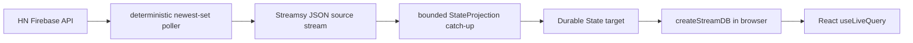

# Hacker News newest StateProjection demo

This example is a complete local Streamsy projection path. A Bun server polls Hacker News,
reconciles the configured newest set, appends only deterministic changes to a JSON source stream,
and runs a bounded `StateProjection.catchUp()` pass. The derived target is a Durable State stream
with source-position headers. The browser replays that target into its own TanStack DB with `createStreamDB` and
renders it through React `useLiveQuery`.


```mermaid
flowchart LR
  HN[HN Firebase API] --> Poller[deterministic newest-set poller]
  Poller --> Source[Streamsy JSON source stream]
  Source --> Projection[bounded StateProjection catch-up]
  Projection --> Target[Durable State target]
  Target --> ClientDB[createStreamDB in browser]
  ClientDB --> React[React useLiveQuery]
```

TanStack DB is browser-only in this demo. One Effect `ManagedRuntime` owns a memory
Layer shared by the poller, projection and HTTP edge. The [private example-local
bridge](src/server/bridge/README.md) is replaced by `@streamsy/derive` in Step 5.

## Data flow

1. `src/server/poller/poller.ts` describes polling with Effect primitives: `Ref`-held state, a
   coalesced poll pass, and an interval loop built from `Effect.repeat` with `Schedule.spaced`.
   `src/server/poller/contract.ts` owns the contracts and `src/server/poller/reconcile.ts` owns
   pure newest-set reconciliation.
   Each pass fetches new ids first and refreshes known ids so mutable fields such as score and
   descendants stay current. It compares complete story values, suppresses unchanged writes, and
   sorts changes deterministically. Stories that leave the bounded newest set become source
   deletes.
2. `src/server/streams.ts` owns distinct `session/main/source` and `session/main` JSON streams
   through the acquired memory services. The public target remains `/streams/session/main`.
3. `src/server/story-index-projection.ts` validates source upsert/delete commands and maps them to
   the public Durable State event vocabulary. Story id is the stable row key. `time`, then `id`, is
   the browser ordering rule.
4. `src/server/projection.ts` describes one bounded catch-up pass as an Effect. The server entry
   runs it through the edge-owned runtime after each poll. The last fact's source offset
   recovers completed progress; expected-offset CAS detects competing target writes.
5. `src/client/main.tsx` consumes only the target stream's State facts.

`/api/status` reports poll/source counters, the configured catch-up bounds, the last projection
outcome and progress, and separate poll/projection failures. `POST /api/poll` waits for one poll and
catch-up attempt before returning the same status fields.

## Run locally

From the repository root:

```bash
bun install
bun run --cwd examples/hackernews-newest-stream dev
```

Open <http://localhost:1339>. Use `PORT` to select another port. For API-only work, run
`bun run --cwd examples/hackernews-newest-stream dev:api`.

Useful environment variables:

- `PORT` (default `1339`)
- `HN_API_BASE` (default `https://hacker-news.firebaseio.com/v0`)
- `HN_POLL_INTERVAL_MS` (default `60000`)
- `HN_NEWEST_LIMIT` (default `50`)
- `HN_PROJECTION_MAX_PAGES` and `HN_PROJECTION_MAX_BATCHES` (default `10`)
- `HN_PROJECTION_MAX_ITEMS` (default twice the newest limit)
- `HN_PROJECTION_MAX_BYTES` (default `1000000`)

## Verify

```bash
bun run --cwd examples/hackernews-newest-stream test
bun run --cwd examples/hackernews-newest-stream typecheck
bun run --cwd examples/hackernews-newest-stream build
bun run --cwd examples/hackernews-newest-stream smoke:http
```

The HTTP smoke is offline. It starts a local HN fixture, verifies initial upserts, then verifies an
update, an entering story, a leaving-story delete, projection source progress, and unchanged-poll
suppression through the public HTTP target.

## Current constraints

- Projection recovery scans complete target history, so recovery cost is O(target history).
- Source and target resources use the same memory Layer for one server run.
- Producer fencing, lineage, checkpoints, generations and replay-safe pending writes are
  deferred; the bridge documents its complete limits.
- The default local server uses in-memory storage. The streams are durable protocol logs for the
  process lifetime; a persistent adapter is required for durability across server-process restarts.
- Catch-up is deliberately bounded. A `limit-reached` status means later poll/repair passes must
  continue convergence; a `boundary-too-large` status requires a larger item or byte bound.
- This example makes no live Cloudflare deployment claim.
