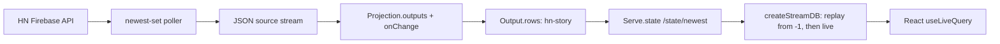

# Hacker News newest stream demo

A Bun server polls Hacker News, appends deterministic newest-set changes to a
source stream, and runs a projection with one declared `Output.rows` output.
`Serve.state` publishes it at `/state/newest`. The React browser reads from `-1`
into TanStack DB through `createStreamDB`, then follows live changes. SQLite
keeps streams and projection progress across server restarts.


```mermaid
flowchart LR
  HN[HN Firebase API] --> Poller[newest-set poller]
  Poller --> Source[JSON source stream]
  Source --> Projection[Projection.outputs + onChange]
  Projection --> Rows[Output.rows: hn-story]
  Rows --> Serve[Serve.state /state/newest]
  Serve --> ClientDB[createStreamDB: replay from -1, then live]
  ClientDB --> React[React useLiveQuery]
```

## Run it

From the repository root:

```bash
bun install
bun run build
bun run --cwd examples/hackernews-newest-stream dev
```

Open <http://localhost:1339>. `dev` builds the browser; `dev:api` runs only the
server and can serve an existing browser build. The page, status API, poll API,
and State route share the same origin, so CORS middleware is unnecessary.
`HttpRouter.serve` hosts one `Layer.mergeAll` app with a scoped Bun listener.

| Variable              | Default                                 | Meaning                                     |
| --------------------- | --------------------------------------- | ------------------------------------------- |
| `PORT`                | `1339`                                  | HTTP port                                   |
| `HN_API_BASE`         | `https://hacker-news.firebaseio.com/v0` | Hacker News API                             |
| `HN_POLL_INTERVAL_MS` | `60000`                                 | Poll interval                               |
| `HN_NEWEST_LIMIT`     | `50`                                    | Size of the newest set                      |
| `HN_PROJECTION_LIMIT` | `10`                                    | Checkpoint transactions per pass            |
| `HN_DB`               | `.data/hackernews.sqlite`               | SQLite file, or `memory`                    |
| `HN_SOURCE_STREAM_ID` | `session/main/source`                   | Stored input identity                       |
| `HN_TARGET_STREAM_ID` | `session/main`                          | Stored rows output identity                 |
| `STREAM_PREFIX`       | `/streams`                              | Raw stream protocol prefix                  |
| `STREAM_CONTENT_TYPE` | `application/json`                      | Status/poll API content type; rows use JSON |

`GET /state/newest?offset=-1` replays retained changes. Resume with the returned
`stream-next-offset`; `live=long-poll` waits for more. The route is read-only and
returns State version and contract headers. The browser sends State version 1.
The stored target id does not change the browser URL.

`GET /api/status` reports poll counters, whether the projection is running, its
last error, and the source offset loaded from the durable checkpoint.
`POST /api/poll` runs one poll; the projection wakes on the storage change feed.
The existing raw stream protocol routes remain under `STREAM_PREFIX`; the browser
uses the read-only State route.

## Where to look

- `src/server/story-index-projection.ts`: `Projection.outputs`, one `hn-story`
  rows output keyed by `id`, and `Output.upsert` / `Output.remove` results.
- `src/server/http.ts`: the served rows, status, poll and static route app.
- `src/server/index.ts`: scoped listener and shared application Layers.
- `src/server/projection.ts`: `Projection.onChange` and checkpoint-backed status.
- `src/server/streams.ts`: one shared SQLite protocol/projection host, with a memory option.
- `src/server/poller/`: the poll loop and pure newest-set reconciliation.
- `src/client/db.ts`: the same browser collection factory used by the HTTP smoke.

## Verify

```bash
bun run --cwd examples/hackernews-newest-stream test
bun run --cwd examples/hackernews-newest-stream typecheck
bun run smoke:hackernews
```

The offline smoke opens an actual TanStack DB session from `-1`, changes a local
HN fixture, and verifies live existing-key upserts and key-only deletes. Another
session replays that history. It restarts the server on the same SQLite file and
checks retained output, checkpoint progress, and exactly two current rows after
replaying fresh post-restart upserts. Unchanged polls append nothing.

## Limits

D1-0 has no snapshot. Every new browser replays the full retained history, which
must remain available and grows even when the newest set stays at 50 rows.
D1-2 (a server-side snapshot) is the follow-up for bounding this work. Recovery
means closing the old collection and opening a fresh one from `-1`. After a server
reset, reload the page: it does not automatically reopen its collection.

The installed `@durable-streams/state` binding updates an existing key in place
without doubling rows, but merges its fields. A field omitted by a later upsert
keeps its old value in the browser, both live and on replay.

The poller's in-memory newest-set cache is rebuilt after a process restart, so
its first poll publishes fresh upserts for the current set. A previously emitted
row that leaves the newest set during downtime stays in the served rows for good
and remains visible on the page. With live HN, most restarts are expected to cause
this as new stories arrive (an expectation, not a measured restart rate).
The restart smoke keeps membership fixed across downtime. The follow-up is
**poller membership recovery**: put the
full newest id set in each source batch, retain known ids in checkpointed
`Output.value` state, and emit removes for departed ids.

Use a fresh database for this phase-5 declaration: earlier checkpoint/output
formats are not migrated. `HN_DB=memory` starts fresh on every process restart.
The application creates only the input stream; the projection creates its output.
An initial Serve read before the output exists returns 404 and creates no data.

Guide: [streamsy.dev/docs/demos/hackernews-newest-stream](https://streamsy.dev/docs/demos/hackernews-newest-stream).
