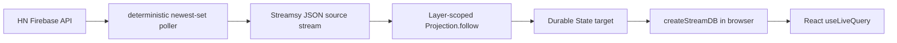

# Hacker News newest stream demo

A complete local Streamsy path. A Bun server polls Hacker News, appends
changes to the newest set to a source stream, and runs a projection that
publishes those changes as a declared Durable State output. The browser replays
that stream into TanStack DB with the official `@durable-streams/state/db`
binding and renders it with React. SQLite keeps streams and projection progress
across server restarts.


```mermaid
flowchart LR
  HN[HN Firebase API] --> Poller[deterministic newest-set poller]
  Poller --> Source[Streamsy JSON source stream]
  Source --> Projection[Layer-scoped Projection.follow]
  Projection --> Target[Durable State target]
  Target --> ClientDB[createStreamDB in browser]
  ClientDB --> React[React useLiveQuery]
```

## Run it

From the repository root:

```bash
bun install
bun run --cwd examples/hackernews-newest-stream dev
```

Open <http://localhost:1339>. `dev:api` runs the server without the browser
build.

| Variable              | Default                                 | Meaning                          |
| --------------------- | --------------------------------------- | -------------------------------- |
| `PORT`                | `1339`                                  | HTTP port                        |
| `HN_API_BASE`         | `https://hacker-news.firebaseio.com/v0` | Hacker News API                  |
| `HN_POLL_INTERVAL_MS` | `60000`                                 | Poll interval                    |
| `HN_NEWEST_LIMIT`     | `50`                                    | Size of the newest set           |
| `HN_PROJECTION_LIMIT` | `10`                                    | Checkpoint transactions per pass |
| `HN_DB`               | `.data/hackernews.sqlite`               | SQLite file, or `memory`         |

`GET /api/status` reports poll counters, whether the follower is running, its
last error, and the source offset loaded from the durable checkpoint.
`POST /api/poll` runs one poll; the follower wakes independently when source
data arrives (or on its one-second repair interval).

## Where to look

- `src/server/poller/`: the poll loop and pure newest-set reconciliation.
- `src/server/story-index-projection.ts`: the `Projection.stream` declaration
  that maps source changes to State events with `State.changes`.
- `src/server/projection.ts`: `Projection.follow`, forked in the application
  Layer scope, plus checkpoint-backed status.
- `src/server/streams.ts`: the shared SQLite protocol and projection Layers,
  with a memory option for tests.
- `src/client/main.tsx`: the browser side, reading only the target stream.

## Verify

```bash
bun run --cwd examples/hackernews-newest-stream test
bun run --cwd examples/hackernews-newest-stream typecheck
bun run --cwd examples/hackernews-newest-stream smoke:http
```

The HTTP smoke is offline: it runs against a local Hacker News fixture, stops
the child process, restarts it on the same SQLite file, and checks resume with
no repeated `(key, txid)` fact.

## Limits

The target grows without bound and the browser replays all of it. A later rung
will use `Projection.fold` over the story set and serve rows to bound that work.
The poller's in-memory newest-set cache is rebuilt after a process restart, so
its first poll may publish fresh upserts for the current set.

The projection id is now `hn-story-index`. Its checkpoint record is deliberately
new; this demo does not preserve records written by the earlier declaration.
Selecting `HN_DB=memory` gives a fresh store after every process restart.

Guide: [streamsy.dev/docs/demos/hackernews-newest-stream](https://streamsy.dev/docs/demos/hackernews-newest-stream).
