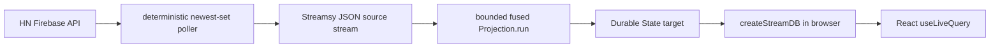

# Hacker News newest stream demo

A complete local Streamsy path. A Bun server polls Hacker News, appends
changes to the newest set to a source stream, and runs a projection that
publishes those changes as a Durable State stream. The browser replays that
stream into TanStack DB with the official `@durable-streams/state/db` binding
and renders it with React.


```mermaid
flowchart LR
  HN[HN Firebase API] --> Poller[deterministic newest-set poller]
  Poller --> Source[Streamsy JSON source stream]
  Source --> Projection[bounded fused Projection.run]
  Projection --> Target[Durable State target]
  Target --> ClientDB[createStreamDB in browser]
  ClientDB --> React[React useLiveQuery]
```

## Run it

From the repository root:

```bash
bun install
bun run --cwd examples/hackernews-newest-stream dev
```

Open <http://localhost:1339>. `dev:api` runs the server without the browser
build.

| Variable                  | Default                                 | Meaning                   |
| ------------------------- | --------------------------------------- | ------------------------- |
| `PORT`                    | `1339`                                  | HTTP port                 |
| `HN_API_BASE`             | `https://hacker-news.firebaseio.com/v0` | Hacker News API           |
| `HN_POLL_INTERVAL_MS`     | `60000`                                 | Poll interval             |
| `HN_NEWEST_LIMIT`         | `50`                                    | Size of the newest set    |
| `HN_PROJECTION_MAX_UNITS` | `10`                                    | Passes per projection run |
| `HN_PROJECTION_MAX_ITEMS` | twice the newest limit                  | Items per pass            |
| `HN_PROJECTION_MAX_BYTES` | `1000000`                               | Payload bytes per pass    |

`GET /api/status` reports poll and projection counters. `POST /api/poll` runs
one poll and one projection run, then returns the same status.

## Where to look

- `src/server/poller/`: the poll loop and pure newest-set reconciliation.
- `src/server/story-index-projection.ts`: the `Projection.make` that maps
  source changes to Durable State events, with the source offset in the
  headers.
- `src/server/projection.ts`: one bounded `Projection.run`, triggered after
  each poll.
- `src/client/main.tsx`: the browser side, reading only the target stream.

## Verify

```bash
bun run --cwd examples/hackernews-newest-stream test
bun run --cwd examples/hackernews-newest-stream typecheck
bun run --cwd examples/hackernews-newest-stream smoke:http
```

The HTTP smoke is offline: it runs against a local Hacker News fixture.

## Limits

Source, target, and checkpoint share one memory Layer, so state lasts for one
server process. Runs are bounded; a `limit-reached` status means the next poll
continues. A source slice larger than `HN_PROJECTION_MAX_BYTES` is refused
whole; raise the budget to accept it.

Guide: [streamsy.dev/docs/demos/hackernews-newest-stream](https://streamsy.dev/docs/demos/hackernews-newest-stream).
