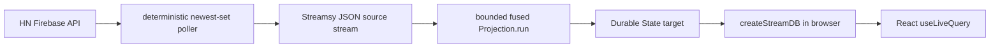

# Hacker News newest stream demo

This example is a complete local Streamsy projection path. A Bun server polls Hacker News,
reconciles the configured newest set, appends only deterministic changes to a JSON source stream,
and runs a bounded `Projection.run` over `@streamsy/projection`. The target is a Durable State
stream with source-position headers. The browser replays that target into its own TanStack DB with
`createStreamDB` and renders it through React `useLiveQuery`.


```mermaid
flowchart LR
  HN[HN Firebase API] --> Poller[deterministic newest-set poller]
  Poller --> Source[Streamsy JSON source stream]
  Source --> Projection[bounded fused Projection.run]
  Projection --> Target[Durable State target]
  Target --> ClientDB[createStreamDB in browser]
  ClientDB --> React[React useLiveQuery]
```

TanStack DB is browser-only in this demo. One Effect `ManagedRuntime` owns a memory Layer from
`@streamsy/projection/memory` shared by the poller, the projection, its checkpoint store and the
HTTP edge. Because source, target and checkpoint live on one memory owner, the projection uses the
fused form: each unit's target appends commit together with its checkpoint.

## Data flow

1. `src/server/poller/poller.ts` describes polling with Effect primitives: `Ref`-held state, a
   coalesced poll pass, and an interval loop built from `Effect.repeat` with `Schedule.spaced`.
   `src/server/poller/contract.ts` owns the contracts and `src/server/poller/reconcile.ts` owns
   pure newest-set reconciliation.
   Each pass fetches new ids first and refreshes known ids so mutable fields such as score and
   descendants stay current. It compares complete story values, suppresses unchanged writes, and
   sorts changes deterministically. Stories that leave the bounded newest set become source
   deletes.
2. `src/server/streams.ts` owns distinct `session/main/source` and `session/main` JSON streams
   through the acquired memory services. `src/server/stream-resources.ts` declares both as typed
   `StreamRef.json` values. The public target remains `/streams/session/main`.
3. `src/server/story-index-projection.ts` is a `Projection.make` over the source ref. Its
   `Projection.each` handler maps every decoded upsert/delete command to the public Durable State
   event vocabulary and appends it to the target inside the checkpoint transaction. Each fact keeps
   the source position: `headers.offset` is the unit's accepted source offset and `headers.txid` is
   `${offset}:${index}` within the unit. Story id is the stable row key. `time`, then `id`, is the
   browser ordering rule.
4. `src/server/projection.ts` describes one bounded `Projection.run` as an Effect. The server entry
   runs it through the edge-owned runtime after each poll. The checkpoint record stores the accepted
   source offset; a restart resumes there and never repeats output. A competing runner fails with a
   `token-conflict` fault instead of advancing.
5. `src/client/main.tsx` consumes only the target stream's State facts.

`/api/status` reports poll/source counters, the configured run budget, the last run's status and
`sourceThrough` offset, and separate poll/projection failures. `POST /api/poll` waits for one poll
and run attempt before returning the same status fields.

## Run locally

From the repository root:

```bash
bun install
bun run --cwd examples/hackernews-newest-stream dev
```

Open <http://localhost:1339>. Use `PORT` to select another port. For API-only work, run
`bun run --cwd examples/hackernews-newest-stream dev:api`.

Useful environment variables:

- `PORT` (default `1339`)
- `HN_API_BASE` (default `https://hacker-news.firebaseio.com/v0`)
- `HN_POLL_INTERVAL_MS` (default `60000`)
- `HN_NEWEST_LIMIT` (default `50`)
- `HN_PROJECTION_MAX_UNITS` (default `10`): passes per run
- `HN_PROJECTION_MAX_ITEMS` (default twice the newest limit): items per pass
- `HN_PROJECTION_MAX_BYTES` (default `1000000`): payload bytes per pass

## Verify

```bash
bun run --cwd examples/hackernews-newest-stream test
bun run --cwd examples/hackernews-newest-stream typecheck
bun run --cwd examples/hackernews-newest-stream build
bun run --cwd examples/hackernews-newest-stream smoke:http
```

The HTTP smoke is offline. It starts a local HN fixture, verifies initial upserts, then verifies an
update, an entering story, a leaving-story delete, projection source progress, and unchanged-poll
suppression through the public HTTP target.

## Current constraints

- Source, target and the projection checkpoint share one memory Layer for one server run. The
  streams are durable protocol logs for the process lifetime; a persistent adapter is required for
  durability across server-process restarts.
- The run is deliberately bounded. A `limit-reached` status means later poll/repair passes must
  continue convergence. A source slice larger than the byte budget is refused whole and the run
  reports `limit-reached` with nothing written; raise `HN_PROJECTION_MAX_BYTES` to accept it.
- This example makes no live Cloudflare deployment claim.
