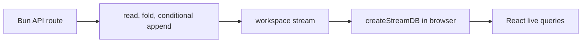

# Issue tracker demo

A complete rung-zero Streamsy application. Promise-native Bun routes read each
workspace stream from the beginning, fold it into Durable State, validate a
mutation, and append one conditional change. The browser replays that same
stream into TanStack DB with `@durable-streams/state/db`.



## Run it

From the repository root:

```bash
bun install --frozen-lockfile
bun run build
bun run --cwd examples/issue-tracker-demo dev
```

Open <http://localhost:1338>. The seeded `main` workspace is ready immediately;
the share control creates isolated workspaces with their own stream.

| Variable           | Default | Meaning                                        |
| ------------------ | ------- | ---------------------------------------------- |
| `PORT`             | `1338`  | HTTP port                                      |
| `ISSUE_TRACKER_DB` | unset   | SQLite file; unset keeps a process-local store |

Set `ISSUE_TRACKER_DB` when state should survive a server restart:

```bash
ISSUE_TRACKER_DB=.data/issues.sqlite bun run --cwd examples/issue-tracker-demo dev
```

Create the parent directory before starting the server.

## How it works

`server/index.ts` acquires the stream services once and shares their context with
`HttpRouter.serve(Http.routes({ prefix: "/streams" }))`. A scoped
`BunHttpServer.layer` retains Bun’s API routes and HTML bundling; protocol paths
fall through to HttpRouter. API handlers submit Effects through the service
runtime. Shutdown closes the listener runtime before the service runtime.

`mutateWorkspace` is the Transact recipe: read the workspace, fold its State
changes, validate against the resulting view, and append with
`expectedOffset`. An `OffsetMismatch` retries the whole recipe, so parallel
writers cannot silently overwrite one another. Project, issue, and comment
changes share one `StreamRef.state` whose collections type both reads and
writes. Because the tracker appends its own events rather than projecting an
upstream stream, each change records the workspace head read by the transaction
as its source offset.

The server keeps no workspace cache. In the browser, `createStreamDB` follows
the public workspace stream and exposes projects, issues, and comments as
TanStack DB collections, including optimistic writes keyed by the transaction
id returned from the API.

## Verify

```bash
bun run --cwd examples/issue-tracker-demo test:unit
bun run --cwd examples/issue-tracker-demo typecheck
bun run --cwd examples/issue-tracker-demo smoke:http
```

The offline HTTP smoke covers projects, issues, comments, workspace isolation,
ten concurrent writers landing with the exact event count and no duplicates, a
direct protocol 409 probe, and a SQLite process restart. The in-process
transaction test uses a read barrier to force a CAS conflict and prove that the
losing writer retries against the new state.

## Limits

With no database path, restarting the server starts with a fresh memory store.
Every mutation replays one complete workspace, so the recipe is deliberately a
rung-zero fit rather than a large-workspace read model. Shared workspace ids are
unguessable-ish links, not an authorization boundary.

Guide: [streamsy.dev/docs/demos/issue-tracker-demo](https://streamsy.dev/docs/demos/issue-tracker-demo).
