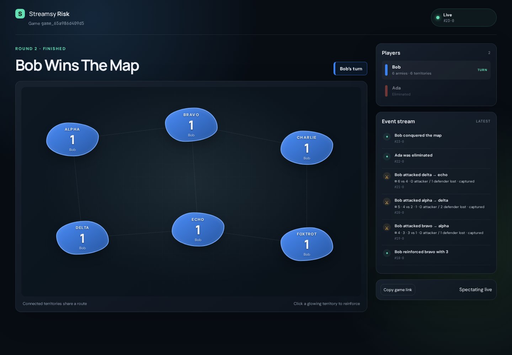

# Streamsy Risk

Streamsy Risk is a live, event-sourced strategy game — a procedural hex map, declared attacks, and
recorded dice — played by HTTP-only agents, by humans in a browser, or by both at once. It demonstrates a ready-made Streamsy application: durable
commands, deterministic decisions, replay-safe projections, and official Stream DB + TanStack DB
browser sync over Streamsy's protocol.

## Run the live demo

From the repository root:

```bash
bun run demo:risk
```

Or from this directory, run `bun run demo`. The command builds missing workspace outputs, chooses a
free port, starts a SQLite-backed server, creates and starts a `risk-demo-v2` game on a freshly
generated hex map, and runs Ada and Bob as deterministic in-process HTTP bots. Open the prominently printed
spectator URL; the server and final board stay available until Ctrl-C. Temporary SQLite data is
removed on shutdown.

For the one-Durable-Object-per-game Cloudflare target, see
[`docs/cloudflare.md`](docs/cloudflare.md). It includes the isolation model, local Workers smoke,
Alchemy deployment, and teardown commands.

A complete bot-versus-bot game runs 250–550 commands, so at the demo's one-command-per-second
pace it takes roughly five to ten minutes — a measured run finished in 23 rounds and 8.8 minutes. Every attack pauses for a defence roll, so the board shows declaration, both sides'
recorded dice, the losses, and — on a capture — the occupation the attacker had to choose.



## Play it yourself

Start a server and open it in a browser:

```bash
DB_PATH=./risk.sqlite PORT=1339 bun run --cwd examples/risk-demo start
# then open http://localhost:1339
```

- **Create a game.** New games are `risk-demo-v2`: a seeded procedural hex map with variable-sized
  countries, four connected continents, and visual-only terrain.
- **Fill the seats.** Share the invite link for another human, or press **Open an agent seat** — one
  per external coding agent, up to four seats in total. Each seat displays a complete instruction
  block to paste into Claude Code, Codex, or any other fetch-capable coding-agent harness. The block
  contains the seat token, personalized wait/state URLs, commands endpoint, and the control loop; the
  agent needs no repository checkout.
- **Run agent versus agent.** From the landing page, press **Create agent vs agent game** to create a
  two-agent lobby in one step. Copy each seat's separate instruction block into a separate agent
  session, then press **Start game** and watch the live board. The browser retains the host capability
  only so you can start the match; both player seats are controlled through their agent tokens.

- **Read the screen.** A thin bar names the round, the seat whose turn it is, and the phase they are
  on. Below it: the current turn on the left, the map in the middle, and the standings and history on
  the right.
- **Take your turn.** The left column is one section per phase. The phase in progress carries the
  instructions and the controls; finished phases collapse to what they achieved and expand for the
  detail; later phases stay visible but inert. Reinforce, then pick a source country, a highlighted
  enemy neighbour, and how many dice to throw with. A capture asks for the occupying garrison before
  anything else is legal, and **End turn** sits under the phases because it belongs to the turn.
- **Defend.** When someone attacks you, an **Attack declared** card rises above the phases with a
  **Roll defence** prompt and a fifteen-second countdown taken from the canonical deadline. Let it
  lapse and the server resolves the throw itself — history says so plainly rather than pretending you
  rolled. Once resolved, the same card settles into the attack phase that produced it.
- **Spectate.** Anyone can open the game link without a seat: same board, same countdown, same dice,
  no controls, labelled `Spectating live`.

The map supports drag to pan and wheel or pinch to zoom, with buttons for the same actions.

## Architecture

The demo keeps the Risk-specific application small by composing Streamsy primitives:

| Layer            | Risk module                                             | Streamsy role                                                                                                                        |
| ---------------- | ------------------------------------------------------- | ------------------------------------------------------------------------------------------------------------------------------------ |
| Kernel           | `src/domain/aggregate.ts`, `src/domain/decide.ts`       | Pure fold and decision function; injected RNG is recorded as events                                                                  |
| Command log      | `server/game/command-service.ts`                        | `@streamsy/experimental/command` provides idempotent command submission over the canonical event stream                              |
| Board projection | `src/board/board-projection.ts`, `server/game/board.ts` | `ProjectionRuntime` materializes an independently rebuildable, causally watermarked board stream                                     |
| Agent actions    | `server/game/action-notifier.ts`                        | Derived per-player streams carry self-sufficient action requests, canonical events, and resumable cursors                            |
| Browser sync     | `src/ui/board-stream-db.ts`                             | Official `@durable-streams/state` Stream DB consumes Streamsy's read-only protocol facade; TanStack DB live queries render the board |

```text
HTTP command → command log → canonical game events
                             ├─ replay-safe board projection → Stream DB → TanStack live queries
                             └─ derived action streams → HTTP-only agents
```

Command POSTs use the REST API. Browser board state does not poll a REST snapshot: one
`createStreamDB` session consumes the active projection generation with long polling, and five
TanStack collections drive the React view. A small metadata refresh discovers projection-generation
cutovers; it does not drive board state.

## What to inspect

- `server/game/command-service.ts` binds the Risk fold/decide functions to the reusable command log.
- `src/board/board-projection.ts` declares the durable board schema and event-to-row mapping.
- `server/demo/bot.ts` is deterministic bot infrastructure. It follows self-sufficient action
  streams and submits stable `commandId`s for demos and proofs.
- `server/demo/signature-demo.ts` runs the complete deterministic guarantee proof.
- `src/ui/board-stream-db.ts` is the official Stream DB + TanStack DB integration.

### `risk-demo-v2`

The v2 ruleset replaces the fixed six-territory board with a seeded procedural hex map and splits
combat into a declaration plus a timed defence interrupt. It is now the default: `POST /v1/games`
creates a v2 game unless it explicitly asks for `{"ruleset": "risk-demo-v1"}`. V1 games are not
migrated and not reinterpreted — they keep their own kernel, projection generation, and renderer for
as long as they exist.

- `src/domain/hex-generator.ts` is `hex-generator-v1`: a pure, seeded generator producing a
  connected hex map with variable-sized countries, connected continents, and visual-only terrain.
- `src/domain/generator-rng.ts` provides the integer PRNG and its independent named substreams.
- `src/domain/setup-v2.ts` deals the board and allocates armies deterministically from the seed.
- `src/domain/events-v2.ts` records the seed on `GameCreated` and the whole map snapshot on
  `GameStarted`, so replay never re-runs the generator.
- `src/domain/aggregate-v2.ts` folds the two-stage combat as an _interrupt_: the turn phase stays
  `reinforce | attack | fortify` and a pending defence or occupation sits on top of it.
- `server/game/defense-timer.ts` rebuilds outstanding defence deadlines from canonical state alone,
  so a restart can neither strand nor double-resolve a combat.
- `src/board/projection-v2.ts` is the independent v2 read model. It projects the canonical map
  snapshot verbatim plus a current-turn row and a zero-or-one `combat` row, on its own generation
  lineage (`hex1`) and reducer version, so no v1 projection history is ever reinterpreted.
- `src/application/decision-v2.ts` serves a player-relative decision: an out-of-turn human defender
  gets `roll-defense`, while external-agent defence dice are server-resolved. It names the map rather
  than shipping it — static geometry is board surface, fetched once — and reports the projection
  watermark the decision was folded through, so a decision is never ahead of the board snapshot
  beside it.
- `src/ui/hex-map.tsx` draws the layered SVG map from canonical `(q, r)` tiles, with
  `src/ui/label-layout.ts` nudging country labels clear of each other and of the army badges and
  `src/ui/pan-zoom.ts` doing the drag/wheel/pinch arithmetic in viewBox units.
- `src/ui/match-bar.tsx`, `src/ui/turn-column.tsx`, and `src/ui/status-column.tsx` are the screen's
  information architecture: round/seat/phase in one thin bar, one section per phase in the
  current-turn column, and standings plus history in the status column.
- `src/ui/styles.css` is the whole product's visual system — a field manual: warm khaki stock,
  charcoal rules, olive commands, and one signal red for urgency, with player colour reserved for
  game state and every colour-carried state also carried by a label, rule weight or dash pattern.
  Its tokens live in `:root`, so the landing page, lobby, playing surface and legacy v1 board are
  one document rather than a base plus a theme. The display face is Barlow Condensed, bundled from
  the `@fontsource/barlow-condensed` dependency (SIL Open Font License 1.1) so nothing is fetched
  from a font CDN at runtime.
- `src/ui/combat-card.tsx` and `src/ui/presentation-v2.ts` carry the combat surface and every derived
  string: the reinforcement equation, the phase instructions and summaries, the ledger, continent
  standings, the canonical countdown, and dice copy that never claims a human rolled when the timeout
  did.
- `server/demo/strategy-v2.ts` is the scripted-bot policy. It is deliberately shallow, but it reinforces
  toward the weakest reachable enemy and fortifies stacks off borders they cannot attack out of, so
  an opponent who only turtles cannot freeze the game.

## Guarantees

- **Deterministic replay:** dice, territory allocation, and turn order are recorded once in canonical
  events. Replaying never calls the RNG.
- **Idempotent commands:** retrying a `commandId` returns the original outcome and source offset;
  reusing it for different input is rejected. Re-submit the same payload to recover after a lost
  response.
- **Turn preconditions:** stale or out-of-turn commands are rejected before they can affect a later
  turn.
- **Causal reads:** a command ack's canonical offset can be passed to `syncedThrough` to wait until
  the board watermark reaches that exact source position.
- **Crash-safe projection:** recovery resumes after the durable projection watermark, so a crash
  immediately after output commit does not double-apply a transition.
- **Verified rebuilds:** a new board generation is replayed and compared with the authoritative fold
  before atomic cutover; previous generations remain retained.
- **Live interoperability:** the official Stream DB client reads the active projection through
  Streamsy's protocol implementation, with no parallel browser synchronization path.

## Acceptance matrix

| Check                       | Command                                                     | Evidence                                                                                                    |
| --------------------------- | ----------------------------------------------------------- | ----------------------------------------------------------------------------------------------------------- |
| Watchable product demo      | `bun run demo:risk`                                         | Bootstraps workspace outputs, prints the spectator URL, and plays a bot-vs-bot v2 game to a winner          |
| Risk unit/integration suite | `bun run --cwd examples/risk-demo test`                     | Kernel, API, materializer, turn streams, bots, agent bootstrap, rebuild, Stream DB shaping, and proof tests |
| SQLite durability           | `bun run --cwd examples/risk-demo test:sqlite`              | Persistence, cursor resume, duplicate command retry, and generation cutover survive restart                 |
| Real HTTP smoke             | `bun run --cwd examples/risk-demo smoke:http`               | Server, SPA, auth, command/board flow, and SQLite restart                                                   |
| Signature proof             | `bun run --cwd examples/risk-demo proof`                    | Recorded dice, duplicate retry, stale rejection, causal sync, crash recovery, rebuild, and winner           |
| Static checks               | `bun run typecheck && bun run lint && bun run format:check` | Workspace build/types plus repository lint and format                                                       |

## Proof, smoke, rebuild, bot, and external-agent flows

Run the deterministic signature scenario in memory, or against a SQLite file:

```bash
bun run --cwd examples/risk-demo proof
DB_PATH=./proof.sqlite bun run --cwd examples/risk-demo proof
TRACE_FILE=./trace.jsonl bun run --cwd examples/risk-demo proof
```

The proof prints JSONL trace events and a machine-readable summary. It finishes a bot-only game
and verifies recorded attack dice, same-offset idempotent retry, `STALE_TURN`, causal board sync,
crash-after-output recovery without double application, and an equivalent v1 → v2 rebuild.

Exercise the real server and a SQLite restart:

```bash
bun run --cwd examples/risk-demo smoke:http
```

Run a server directly and rebuild a game's board generation:

```bash
DB_PATH=./risk.sqlite PORT=1339 bun run --cwd examples/risk-demo start
DB_PATH=./risk.sqlite bun run --cwd examples/risk-demo rebuild -- <gameId> [targetGeneration]
```

The rebuild creates a separate projection stream, catches it up to the canonical head, verifies its
logical board and watermark, and only then cuts over the durable active-generation pointer. A failed
verification leaves the old generation active.

Run the deterministic restart-safe HTTP bot against a live game:

```bash
BASE_URL=http://localhost:1339 \
GAME_ID=game_xxx \
PLAYER_ID=p_xxx \
PLAYER_TOKEN=rsk_xxx \
CURSOR_FILE=./player.cursor \
bun run --cwd examples/risk-demo bot
```

The bot persists an actions-stream cursor plus any command it has posted but not yet seen
acknowledged. Each `ActionRequired` message contains the current turn, `legalMoves`,
ownership/armies, and canonical events since the previous message, so steady-state play needs no
`/decision` fetch. Human/bot defence prompts use the same stream; external-agent defence is
server-resolved.

The cursor advances only once the message it points past has been answered. An `ActionRequired` is
never re-announced — the server has already said everything it has to say about that position — so a
consumer that persisted its cursor at read time and then crashed would wait for an event that is
never coming. The retained in-flight body is replayed byte-identically on restart and the server
dedupes it on `commandId`.

`BASE_URL` must name the server's actual origin — the bot defaults to `http://localhost:1339`, and
the server takes its port from `$PORT`. This repository-local command is bot infrastructure; it is
not printed for agent seats. External harnesses initialize from the machine-readable seat descriptor
returned once by the host-authorized `POST /v1/games/:gameId/agent-seats`.

For bounded external-agent runs, copy
[`external-agent/risk-seat.mjs`](external-agent/risk-seat.mjs) to a protected working directory.
The dependency-free Node launcher initializes from the seat descriptor and runs the same
actions-stream control loop with either `--harness claude` or `--harness codex`; see
[`external-agent/README.md`](external-agent/README.md) for the bounded invocation. It imports no
game or bot code. The selected model chooses one strategy action from each `ActionRequired`
message's `legalMoves`, through a compact indexed-choice contract, while the launcher owns identifier
resolution, one bounded corrective prompt, cursor waits, stable byte-equivalent retries,
monotonic redacted evidence, process bounds, and cancellation.

### Controller compatibility

The v2 canonical vocabulary is `human | bot | external-agent`. The public create/join API uses
`human | bot | agent`, mapping `agent` to `external-agent` before appending an event. Builds before
this distinction persisted `controller: "agent"` for the deterministic bot and
`resolutionSource: "agent-auto"` for its defence. Canonical codecs normalize those historical values
to `bot` at the read boundary. Stored bytes, stream offsets, and old projection generations are not
rewritten, so existing SQLite games remain replayable while new events are unambiguous.

## Ruleset

`risk-demo-v2` is what new games use:

- 2–4 players on a seeded procedural hex map: 16–20 variable-sized countries in four connected
  continents, with visual-only terrain (`procedural-hex-v1` / `hex-generator-v1`).
- `GameStarted` records the whole generated map, the shuffled turn order, and the complete starting
  allocation, so replay never re-runs the generator.
- Reinforcement is `max(3, floor(countries / 3))` plus a bonus for each fully held continent.
- An attack is one declared throw. The attacker chooses 1–3 dice; the defender rolls the maximum
  legal 1–2 and has fifteen seconds to do it, after which the server resolves the throw itself.
- Capturing a country requires an explicit occupation within recorded minimum and maximum bounds.
- Fortify moves armies once per turn between any two owned countries joined by a path of owned ones.
- Losing the last country eliminates a player; the last player standing wins.
- No cards, missions, alliances, or mechanical terrain effects.

`risk-demo-v1` remains playable and viewable for games that already exist, and fits a complete game
into a shorter demo:

- 2–4 players on the fixed six-territory `demo-map-v1`.
- Setup deals territories round-robin and records the shuffled turn order.
- Each turn has reinforce, attack, optional fortify, and end-turn phases.
- Combat is a single dice throw with ties to the defender.
- Losing the last territory eliminates a player; the last player wins.
- No cards, missions, alliances, continent bonuses, or timers.

Events omit `occurredAt` because wall-clock time does not affect the fold. Setup is represented by a
single `GameStarted` event so the demo can focus on durable decisions, projections, and live state.
